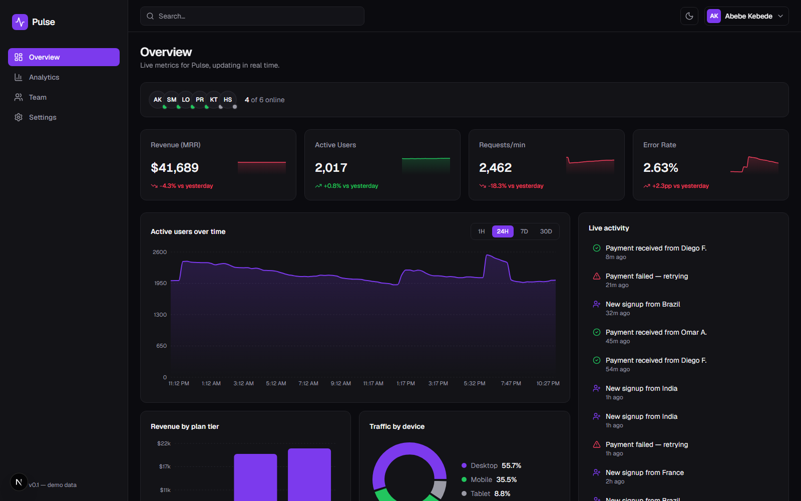

<div align="center">

# Pulse

**A real-time team analytics dashboard for a fictional SaaS company.**



**Live demo:** _coming soon_ · Built with Next.js, Recharts, and Zustand


</div>

---

Pulse is a polished, portfolio-grade analytics dashboard that shows live-updating business metrics — revenue, active users, request throughput, error rate, conversion funnels, team presence, and a scrolling activity feed — for a fictional SaaS company. Nothing is wired to a real backend: a self-contained, seeded data simulator drives every chart and number, so the dashboard feels alive within seconds of opening it, with zero interaction required.

## Features

- **Overview dashboard** — 4 animated KPI cards (MRR, active users, requests/min, error rate) with sparklines and trend indicators, an active-users chart with 1H/24H/7D/30D range toggle, revenue-by-plan and traffic-by-device charts, a live activity feed, and an online-team-members strip.
- **Analytics** — conversion funnel (visitors → signups → trials → paid), a sortable traffic-sources table with trend sparklines, and a visitors-by-country breakdown.
- **Team** — presence grid of team member cards and an activity timeline grouped by day.
- **Settings** — theme preference and notification toggles.
- **Dark mode by default**, with a persisted light-mode toggle and no flash of the wrong theme on load.
- **Fully responsive** — sidebar collapses to a bottom tab bar on mobile; charts and tables stay legible down to 375px wide.
- **Accessible** — semantic landmarks, skip-to-content link, visible focus rings, `aria-label`'d charts, `aria-live` activity feed, and `prefers-reduced-motion` support. Audited to zero [axe-core](https://github.com/dequelabs/axe-core) violations across all four pages in both themes.

## Tech stack

- **Next.js 16** (App Router) + **TypeScript** (strict mode)
- **Tailwind CSS v4** for styling
- **Recharts** for all charts
- **Zustand** for theme state
- **Vitest + React Testing Library** for tests
- Simulated real-time data stream (see [Architecture decisions](#architecture-decisions)) — no external backend

## Running locally

```bash
npm install
npm run dev
```

Open [http://localhost:3000](http://localhost:3000). The dashboard starts moving immediately — no setup, no environment variables, no database.

Other scripts:

```bash
npm run build   # production build
npm run lint    # eslint
npm test        # vitest (single run)
npm run test:watch
```

## Architecture decisions

### Why a simulated stream, and how to swap in Supabase

Everything the dashboard shows comes from `src/lib/dataStream.ts`, a single in-memory `DataStream` class that:

1. **Seeds 30 days of history** on first use — a seeded PRNG (`src/lib/rng.ts`) runs a mean-reverting random walk for every KPI, so history is realistic (small steps, occasional spikes, no runaway drift) and charts are full immediately rather than growing from empty.
2. **Emits updates every 2–4 seconds** via a plain `subscribe(listener)` / `getSnapshot()` pair — deliberately the exact shape React's `useSyncExternalStore` expects.
3. Is consumed **only** through `useLiveData()` (`src/hooks/useLiveData.ts`). No component ever imports `dataStream` directly or touches `Math.random`/timers itself.

That last point is the reason a real backend can be swapped in later without touching a single chart or page component:

```ts
// Today:
subscribe = (listener) => { /* setTimeout-driven tick loop */ }
getSnapshot = () => this.snapshot

// Swapped for Supabase Realtime:
subscribe = (listener) => {
  const channel = supabase
    .channel("dashboard")
    .on("postgres_changes", { event: "*", schema: "public", table: "activity_events" }, () => {
      this.snapshot = mergeUpdate(this.snapshot, payload);
      listener();
    })
    .subscribe();
  return () => channel.unsubscribe();
};
getSnapshot = () => this.snapshot // unchanged
```

`useLiveData()` and every consuming component are unaffected — they only ever see "a snapshot changed."

### State management

- **Zustand** owns exactly one piece of global client state: the theme (`src/store/useThemeStore.ts`). It's paired with a blocking inline script in `layout.tsx` that reads `localStorage` before first paint, so there's no light-mode flash on a dark-default app.
- **Everything else is server-shaped data, not app state** — the live dashboard data flows through `useSyncExternalStore` (via `useLiveData()`), not a global store, because it's an external, time-varying data source being synchronized into React, not client-owned UI state. Reaching for Zustand there would just be a second source of truth to keep in sync with the stream.
- Local, component-only state (sort column, notification toggles, chart range) is plain `useState` — no need for anything heavier.

### Accessibility approach

Accessibility was treated as a hard requirement, not a pass at the end:

- Semantic `nav` / `main` / `aside` landmarks and a skip-to-content link from the very first commit.
- Every chart container carries a descriptive `aria-label` (e.g. "Area chart of active users over the last 24H, currently trending up"); decorative sparklines are marked `aria-hidden` with their chart's built-in focus layer explicitly disabled so they can't trap keyboard focus.
- The live activity feed and activity timeline are `aria-live="polite"` / keyboard-focusable scroll regions.
- `usePrefersReducedMotion` (backed by `useSyncExternalStore` over `matchMedia`) disables the JS-driven count-up animation; a global CSS rule collapses all keyframe animations (fade-ins, feed slide-ins) to ~0 duration for anyone with `prefers-reduced-motion: reduce`.
- The whole app was run through an [axe-core](https://github.com/dequelabs/axe-core) audit across all four pages in both themes — that pass caught (and this repo fixes) a sub-AA color contrast ratio on the accent color, a focusable element hidden inside an `aria-hidden` sparkline, and unreachable scroll regions.

## Project structure

```
src/
  app/            # routes (Overview, Analytics, Team, Settings)
  components/
    ui/           # primitives: Card, Skeleton, Switch
    layout/       # Sidebar, Topbar, MobileNav, ThemeToggle, AppShell
    dashboard/    # Overview page components
    analytics/    # Analytics page components
    team/         # Team page components
    settings/     # Settings page components
  hooks/          # useLiveData, useCountUp, usePrefersReducedMotion
  lib/            # dataStream, rng, format, downsample, fixtures
  store/          # useThemeStore (Zustand)
  types/          # shared domain types
```
